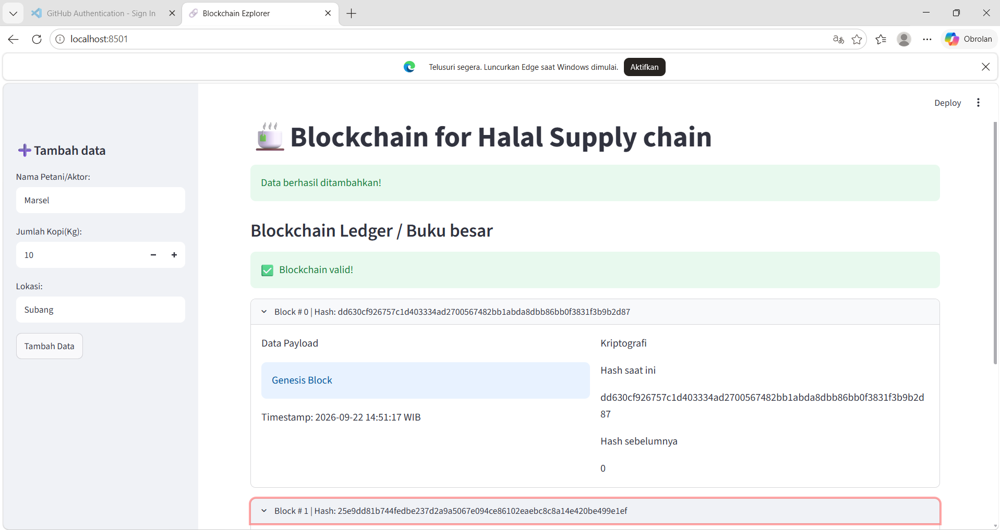

PRAKTIKUM BLOKCHAIN PERTEMUAN3

tujuan praktikum
1.mahasiswa mampu memahami konep object=oriented programing(oop) pada python melalui pembuatan class.
2.nahasiswa mampu mengemplementasikan arsitektur modular dengan memisahkan logika (ui).
3.mahasiswa dapat membangun struktur linkked list terenskripsi menggunakan hash pointers.
4.mahasiswa mampu mensimulasikan sistem "traceabillity rantai pasok kopi" sederhana di lingkungan lokal.

DESKRIPSI PRAKTIKUM
1.membuat 2 buah file di dalam folder pertemuan3 yaitu: core.py dan app.py
